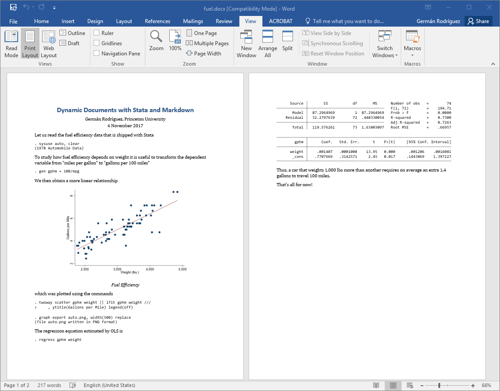

Dynamic Word Documents
======================

`markstat` 2.0 can generate Word documents from the same script used to
generate HTML or PDF via LaTeX. Here\'s the example in my [SJ 17-3
article](https://www.stata-journal.com/article.html?article=pr0067),
expanded to use metadata and inline code.

<code>fuel.stmd</code>

~~~~

~~~~

Save the script as `fuel.stmd`, or download it from this website using
the Stata command

    copy https://grodri.github.io/markstat/fuel.stmd fuel.stmd

The command `markstat using fuel` will generate a web page. Adding the
`docx` option, so the command becomes `markstat using fuel, docx`,
generates a Word document instead. A screen capture of the output is
shown below, or download the document [here](fuel.docx).

If you have a LaTeX installation, changing the option to `pdf` will
generate a PDF file via LaTeX, as shown [here](fuel.pdf). 
Of course you can always save a Word document as PDF, so the `pdf` 
option is really for LaTeX aficionados who want to take advantage
 of features unique to that format.

The figure size of 4.5 inches was chosen to produce good page breaks in
both Word and LaTeX, a tall task given the differences in layout. At the
time of writing there is no simple way to control page breaks in Word,
other than editing the output document.

### The Reference Document

Generation of Word documents relies on a reference document called
`markstat.docx`, which is installed together with `markstat` in your ado
PLUS folder. This document serves as a template of sorts, and ensures
that Stata output is rendered well. You can edit this document to modify
built-in styles or to define your own styles. If you save your
customized reference document as `markstat.docx` in the current working
directory, it will be used instead of the default. This allows you to
define different styles for different projects, each in its own working
directory.

**Built-In Styles**. Pandoc uses a number of built-in styles, such as
Title, Author and Date. Suppose you wanted the title, author and date
block to be single spaced. To customize these styles, copy
`markstat.docx` to your current working directory and then open it in
Word.Modify the Title style, selecting Format, then Paragraph, and under
Spacing changing After to 0 pt. Do the same for the Author and Date
styles. Save the reference document. When you run `markstat` the title
block will be single spaced.

**Custom Styles**. Pandoc lets you assign attributes to text spans and
blocks, and scripts generating Word documents may use the
\"custom-style\" attribute to assign a custom style. For example to
highlight some text 
you can code

    [some text]{custom-style="Highlight"}

This works in Word because `markstat`\'s default reference document
includes a custom \"Highlight\" style, but there is nothing to stop you
from creating your own custom styles.

**Paragraph Styles**. In addition to character styles such as
\"Highlight\", you can define paragraph styles. Suppose you want to
create an indented paragraph style. Make a copy of `markstat.docx`, open
it in Word, and create a style called Indented, inheriting from the
Normal paragraph style, but setting Indentation Left and Right, for
example to 1 (inch) each. Save the reference document. You can now
include an indented paragraph in your Word document by coding

~~~
::: {custom-style="Indented"}
    The text here will be *indented* in the Word document. This works  because 
    we are using a customized reference document that defines this custom style.
:::
~~~

This uses Pandoc 2.0\'s new syntax for text blocks, similar to code
fences but using colons. Inside the colon fences you may use Markdown
syntax as usual, as I did with the word *indented*, which will appear in
italics.

**Underline**. Markdown has no syntax for underline. When you are
generating HTML you can always use the `<u>` and `</u>` tags, as Pandoc
(and indeed all Markdown processors) pass HTML raw input straight to the
output. A `markstat` built-in extension intercepts these tags for
`latex` and `docx` formats and translates them appropriately, in the
case of Word by using a custom style. This means that you can use
underline tags in all three output formats.

Stata 15
--------

The comparison between `markstat` and the new tools in Stata 15 has been
expanded to compare the `docx` option with `putdocx`, see [Word
Documents](stata15#7-word-documents). There you will also find a link to an 
example reproducing the output in the announcement of `putdocx`.

<small>New in `markstat` 2.0</small>
