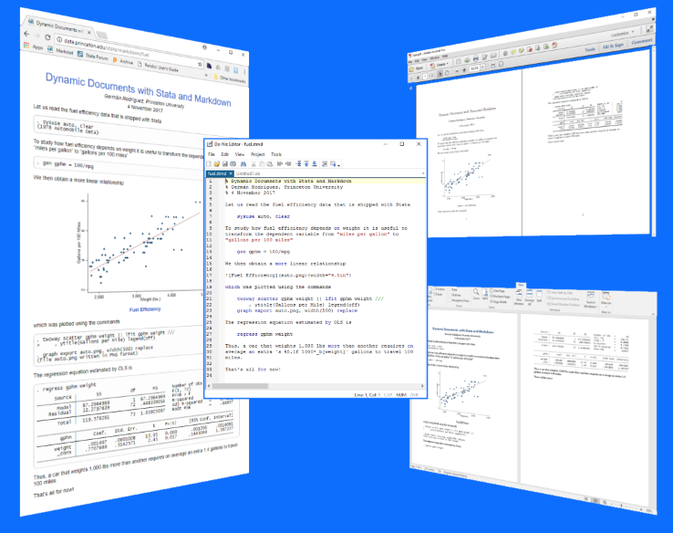
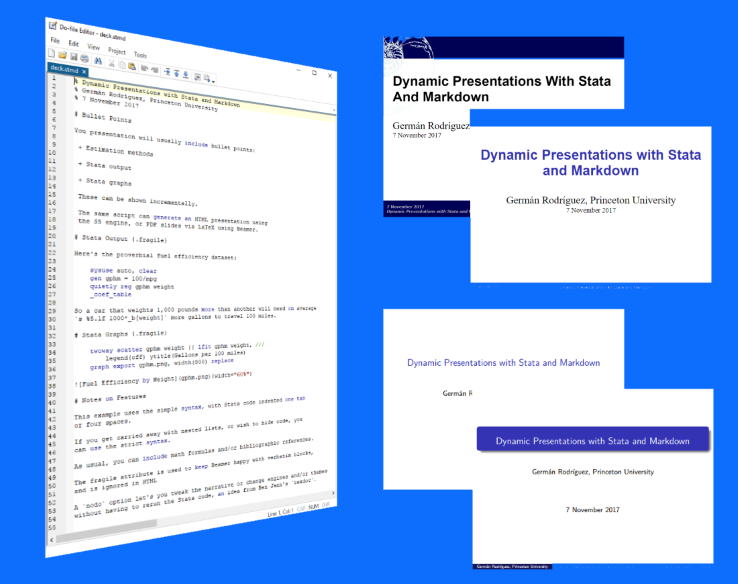

 The <code>markstat</code> command lets you combine <u>Mark</u>down
annotations with <u>Stat</u>a commands to produce dynamic documents and
presentations.

<!--
-->

 <ul class="nav nav-tabs">
    <li class="nav-item">
    <a class="nav-link active" data-bs-toggle="tab" aria-current="page" href="#documents">Documents</a>
    </li>
    <li class="nav-item">
    <a class="nav-link" data-bs-toggle="tab" 
    href="#presentations">Presentations</a>
    </li>      
</ul>

Use Stata's code editor to write a script as shown above center,
and then generate the web page on the left, the PDF document on the
top right, or the Word document on the bottom right, all from the same
script! You can view the script [on this page](simpleScript),
where you will also find links to the resulting web page, PDF file and
Work document.

The script on the left shows a slide show, which is rendered 
on the right using HTML with the S5 engine at the top 
(showing the default Spiral and Santiago themes), 
and using  PDF via Beamer at the bottom 
(showing the default and Madrid themes).
You can view the script [on this page](presentations), where you
will also find links to the presentations.

In this website you will find detailed information on how to 
create documents that combine Markdown with Stata, including tips
on [getting started](gettingStarted), the [documentation](documentation) 
of the command, and more than twenty [examples](examples).
Stata 15 introduced support for Markdown and dynamic documents. A
comparison of the official commands with `markstat` may be found
[here](stata15).

