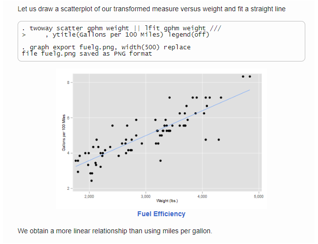
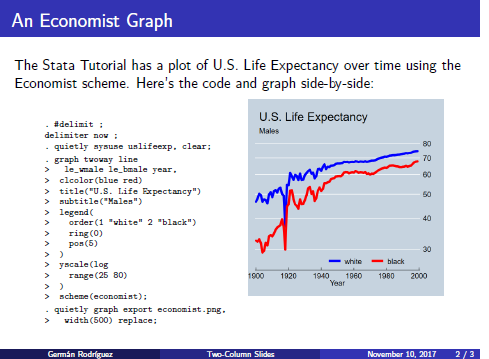

 The <code>markstat</code> command lets you combine <u>Mark</u>down
annotations with <u>Stat</u>a commands to produce dynamic documents and
presentations.

### Scripts

The basic idea is to write Markdown annotations with Stata code indented
one tab or four spaces, as in the following script:

<pre>
% Stata Markdown

Let us read the fuel efficiency data that is shipped with Stata

    sysuse auto, clear

To study how fuel efficiency depends on weight it is useful to
transform the dependent variable from "miles per gallon" to
"gallons per 100 miles"

    gen gphm = 100/mpg

Let us draw a scatterplot of our transformed measure versus weight
and fit a straight line

    twoway scatter gphm weight || lfit gphm weight ///
        , ytitle(Gallons per 100 Miles) legend(off)
    graph export fuel.png, width(500) replace

{width="4.5in"}    

We obtain a more linear relationship than using miles per gallon.
</pre>

The full script, which also runs a regression, may be found
[here](simpleScript). 

### Documents

Running the command `markstat using auto` produces the web page 
shown [here](auto.html). The partial screen capture below will 
give you an idea of the output:

If you add the option `pdf` you will produce the PDF document shown
[here](auto.pdf). If you use the option `docx` instead, you will obtain
the Word document shown [here](auto.docx). All from the same script!

By the way, if you run the code and your graph looks a bit different
from mine, this is because I use the `plottig` scheme in Stata.

### Presentations

You can also generate dynamic presentations that use the HTML S5 engine,
or produce Beamer slides in PDF format, all written using `markstat` to
combine Markdown with Stata.

Consider as an example the following slide, that shows Stata code and a
graph side by side. This is part of a Beamer deck.

  A
Slide in a Two-Column Deck

The complete script generating a two-column presentation with three
slides is available [here](twoColumnSlides). You can view the S5 engine
output with the Santiago theme [here](santiago.html), and the Beamer
slides using *exactly* the same script with the `beamer(madrid)` option
[here](madrid.pdf).

### Next Steps

The `markstat` command was introduced in the *Stata Journal*, see \[G.
Rodríguez (2017) "Literate Data Analysis using Stata and Markdown",
*Stata Journal*, Volume 17, Number 3, pp. 600-619\]
(https://www.stata-journal.com/article.html?article=pr0067). More
extensive and up-to-date documentation will be found on this website.

The [Getting Started](gettingStarted) section shows how to install
`markstat` and the required `whereis` command from SSC. You will also
find download instructions for Pandoc, the document converted used to
handle Markdown, and notes on the requirements for producing PDF via
LaTeX on Windows, Macs and Linux.

The [Documentation](documentation) section expands a bit on the
command's help file. It describes how it works, explains the command
syntax, has a short introduction to Markdown, and discusses how to
handle mathematical equations, metadata, code blocks and inline code,
tables, figures, citations, and presentations.

You will then find a large number of [Examples](examples), ranging from
the simple script introduced here to a more complex example fitting
Cox's proportional hazards model using Stata and R, with Bootstrap tabs
to shift between versions.

Stata 15 introduced support for Markdown and dynamic documents. A
comparison of the official commands with `markstat` may be found
[here](stata15).

