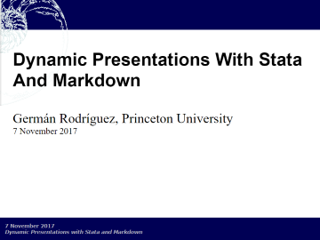
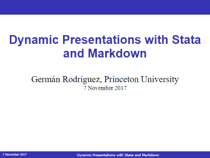
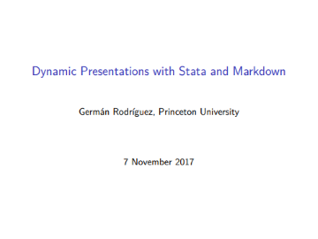
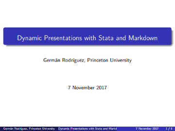

Dynamic Presentations {#presentations}
=====================

`markstat` 2.0 leverages the amazing Pandoc to support presentations in
HTML using the S5 engine, or in PDF via LaTeX using Beamer. Here is a
simple four-slide example. It starts with metadata to define the title,
author and date, which are used to generate a title slide. Each heading
at level 1 then defines a slide. The rest is pretty self-explanatory.

<code>deck.stmd</code>

<pre>

</pre>

Save the script as `deck.stmd` in the current working directory. Or
download the script from this website using the Stata command:

    copy https://grodri.github.io/markstat/deck.stmd .

Issuing the command `markstat using deck, slides` will produce the HTML
presentation using the S5 engine [shown here](s5.html).
Changing the option to `slides(santiago)` uses the new Santiago theme
instead, as [shown here](santiago.html). This theme works
better with multi-part presentations. In both cases, adding the `bundle`
option results in a self-contained presentation that includes all
images, css and JavaScript files. Here are the title pages for both
themes:

  

    

       S5 Default
    

    

       S5 Santiago
    

  

S5 slides also have a printer-friendly outline mode, that you can reach
by hovering on the bottom right for the default theme, top right for the
Santiago theme, and clicking on
[∅]. 
You will also see navigation arrows and a combo box to jump directly to 
any given slide.

Is you have a LaTeX installation you can issue the command
`markstat using deck, beamer` to generate a Beamer presentation using
the default theme, as [shown here](beamer.pdf). 
Change the option to `beamer(madrid)` to use the Madrid theme, with 
the results [shown here](madrid.pdf). You can use any of the many
Beamer themes available. A nice theme gallery may be [found
here](https://deic.uab.es/~iblanes/beamer_gallery/). Here are the title
pages for both themes:

  

    

       Beamer Default
    

    

       Beamer Madrid
    

  

Tinkering with engines and/or themes is facilitated by the `nodo`
option, which lets you change the narrative or the style of the
presentation, without having to rerun the Stata code generating the
images and tables.

For best results I recommend you install the latest version of Pandoc,
available at
[pandoc.org/installing.html](https://pandoc.org/installing.html). The
examples linked here were first ran with `markstat` 2.0.1 using Pandoc
2.0.1.1. 
For another example see [two-column slides](twoColumnSlides).

Note: You may wonder how I produced four files with different names
from the same script, when `markstat` uses the name of the script for
all output files. 
A simple hack: after each run I copied the output file, for example 
`copy deck.html santiago.html`, or `copy deck.pdf madrid.pdf`.

New in `markstat` 2.0
