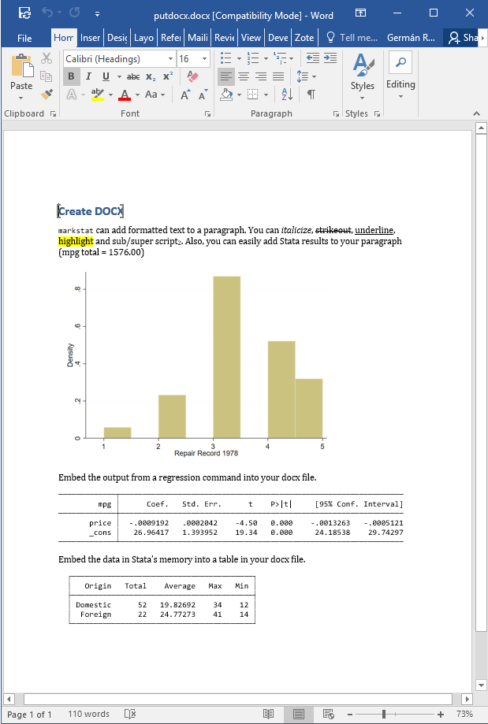

## Word Documents

Stata 15 has a `putdocx` command that can automate the production of Word documents using low-level instructions. The `markstat` command can achieve equivalent results using Markdown to author the document.

The example below, taken from Stata 15's announcement of `putdocx`, shows the code in Stata's `samplereport.do` and the equivalent `markstat` script,
which we suggest is easier to read and write.

<ul class="nav nav-tabs">
<li class="nav-item"><a class="nav-link active" data-bs-toggle="tab" 
    href="#putpdf">putpdf</a></li>
<li class="nav-item"><a class="nav-link" data-bs-toggle="tab" 
    href="#markstat">markstat</a></li>
</ul>

<pre class="tab-pane active" id="putpdf">

</pre>
<pre class="tab-pane" id="markstat">

</pre>

This example is not very representative because it doesn't have a lot of text. Markdown does not have a syntax for underline, but `markstat` accepts the HTML 
tags <u> and </u> and converts them as needed for Word (as well as LaTeX). 
For shading I used a "Highlight" custom style, that comes with the Word reference 
document used by `markstat`. Other custom styles can be added by editing the 
reference document.

The output of `putdocx` is available from the Stata website as a screen capture
[here](https://www.stata.com/features/overview/create-word-documents/).

The output from markstat is shown below as a screen capture, and is also available as Word document. The input script can be downloaded from this site.

