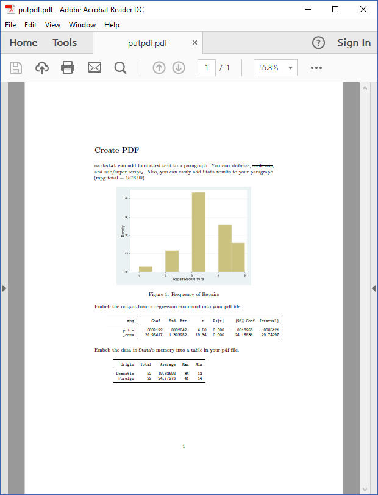

### PDF Files

Stata 15 has a `putpdf` command that can automate the production of PDF files using low-level instructions. The `markstat` command can achieve equivalent results using Markdown to author the document.

The example below, taken from Stata 15's announcement of `putpdf`, shows the code in `samplereport.do` and the equivalent `markstat` script, which reproduces all results but skips changing the background color of text1.

<ul class="nav nav-tabs">
<li class="nav-item"><a class="nav-link active" data-bs-toggle="tab" 
    href="#putpdf">putpdf</a></li>
<li class="nav-item"><a class="nav-link" data-bs-toggle="tab" 
    href="#markstat">markstat</a></li>
</ul>

<pre class="tab-pane active" id="putpdf">

</pre>
<pre class="tab-pane" id="markstat">

</pre>

This example is not very representative because it doesn't have a lot of text. The output of `putpdf` is available from the Stata website 
[here](https://www.stata.com/features/overview/create-pdfs/). 
The output from `markstat` is  [here](mkpdf.pdf), 
with a reduced screen capture below. The input script is [here](mkpdf.stmd).

[1] The background color can be changed in HTML using the Markdown syntax
`[bgcolor]{style="background-color:rgba(0,0,255, 0.3)"}` or a span tag, 
and in PDF by using LaTeX code as shown 
[here](mkpdf2.stmd) with output [here](mkpdf2.pdf). 
In both cases I changed  the opacity of the blue background to make the black 
text more readable than in Stata's original.