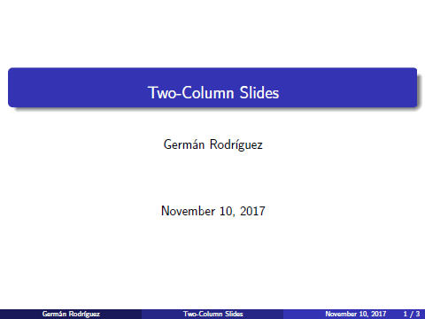
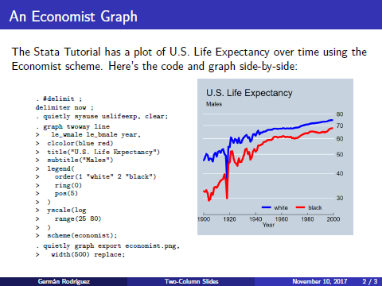
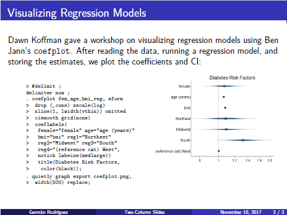

Two-Column Slides
=================

`markstat` 2.0 lets you take advantage of Pandoc\'s new syntax for
columns, as illustrated in the following example using slides that show
code and graphs side-by-side. Let us start with the script, which
defines two slides. In both cases there is a left column with Stata code
using the strict syntax, and a right column with a figure. I also change
the delimiter to `;` to allow the code to stretch over several lines
without continuation comments.

<code>deck2.stmd </code>

<pre>

</pre>

The new syntax here is the use of colon fences, which are similar to
code fences. The outer fences define columnar output, and the inner
fences define the columns, which here default to equal width. For
clarity I used six colons for the outer fences and three colons for the
inner ones, but all that\'s required is three or more colons. Pandoc can
distinguish opening and closing fences because openers always have
attributes, here `{.columns}` for the outer one and `{.column}` for each
of the inner ones. Inside these divisions we can use Markdown and Stata
code as usual.

Save the script as `deck2.stmd` in the current working directory. Or
download the script from this website using the Stata command:

    copy https://grodri.github.io/markstat/deck2.stmd .

Issuing the command `markstat using deck2, strict slides(santiago)`
will produce the HTML presentation using the S5 engine with the Santiago
theme [shown here](deck2.html) and embedded below:

<iframe clas="mb-3" width="480" height="360" src="deck2.html"></iframe>

If you have a LaTeX installation you can use the command
`markstat using deck2, strict beamer(madrid)` to generate a PDF
presentation via LaTeX using Beamer with the Madrid theme, as shown
[here](deck2.pdf). 
You can see screen captures of these slides in the carousel below.

  

    

      
    

    

      
    

    

      
    

  

  <button class="carousel-control-prev" type="button" data-bs-target="#beamer" data-bs-slide="prev">
    
    Previous
  </button>
  <button class="carousel-control-next" type="button" data-bs-target="#beamer" data-bs-slide="next">
    
    Next
  </button>

Of course you can use any of the many Beamer themes available.

<small>New in `markstat` 2.0</small>
